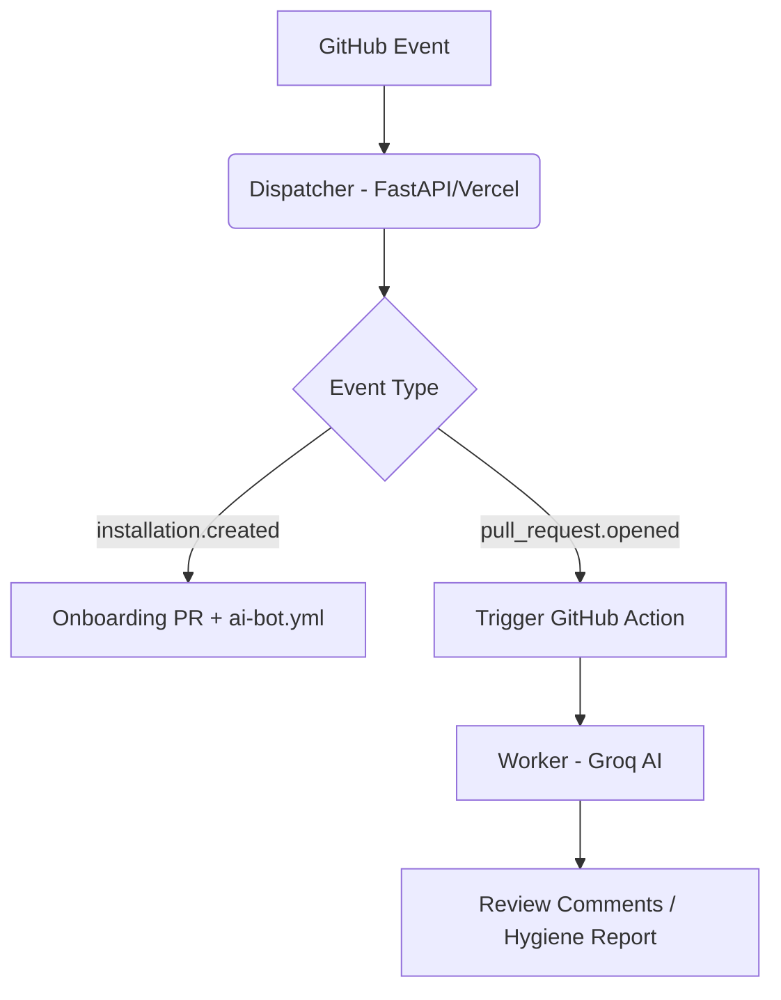

# 🌳 RepoRanger

**The Zero-Cost, Privacy-First Repository Guardian**

RepoRanger is a "Dispatcher-Worker" relay model GitHub App that provides AI-powered code reviews and automated branch hygiene. Unlike other services, RepoRanger runs on *your* infrastructure (GitHub Actions), ensuring your code and secrets never leave your environment.

## 🚀 Key Features

- **🛡️ Distributed Monorepo Model**: The Dispatcher routes webhooks; the Worker (running in your Repo) does the heavy lifting.
- **🤖 AI PR Reviewer**: Powered by Groq (Llama-3-8b) for lightning-fast, senior-level architectural feedback.
- **🧹 Branch Janitor**: Automatically identifies stale branches and provides signed deletion links to keep your repo clean.
- **💰 Zero Infrastructure Costs**: Built to run on Vercel (Free Tier) and GitHub Actions.
- **🔐 Privacy First**: RepoRanger never handles your `GROQ_API_KEY`. It stays in your GitHub Secrets.

## 🛠️ Architecture

## 📦 Setup Instructions

### 1. Host the Dispatcher
Deploy the `/apps/dispatcher` folder to Vercel. 
Environment Variables needed:
- `APP_ID`: Your GitHub App ID.
- `GITHUB_APP_PRIVATE_KEY`: Your GitHub App private key.
- `WEBHOOK_SECRET`: Your GitHub App webhook secret.
- `DELETE_SECRET`: A shared secret for branch deletion links.

### 2. Configure GitHub App
- **Permissions**: Pull Requests (R/W), Contents (R/W), Actions (R/W), Issues (R/W).
- **Webhooks**: Point to `https://your-vercel-app.com/webhook`.

### 3. Usage
Once installed, RepoRanger will automatically open a **Welcome PR** with instructions to add your `GROQ_API_KEY` to your secrets. 

## ⚖️ License
Apache 2.0
