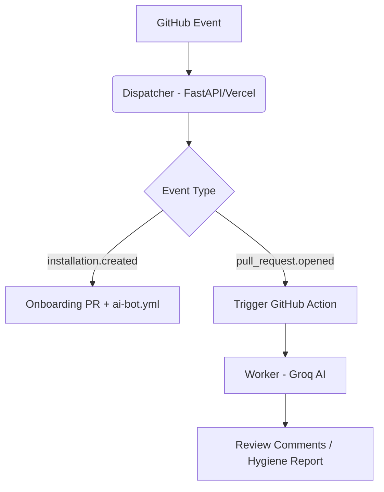

# 🌳 RepoRanger

**The Zero-Cost, Privacy-First Repository Guardian**

RepoRanger is a "Dispatcher-Worker" relay model GitHub App that provides AI-powered code reviews and automated branch hygiene. Unlike other services, RepoRanger runs on *your* infrastructure (GitHub Actions), ensuring your code and secrets never leave your environment.

## 🚀 Key Features

- **🛡️ Distributed Monorepo Model**: The Dispatcher routes webhooks; the Worker (running in your Repo) does the heavy lifting.
- **🤖 AI PR Reviewer**: Powered by Groq (Llama-3.3-70b) for lightning-fast, senior-level architectural feedback.
- **🧹 Branch Janitor**: Automatically identifies stale branches, posts rich hygiene reports, and provides signed deletion links.
- **💰 Zero Infrastructure Costs**: Built to run on Vercel (Free Tier) and GitHub Actions.
- **🔐 Privacy First**: RepoRanger never handles your `GROQ_API_KEY`. It stays in your GitHub Secrets.

## 🛠️ Architecture

## 📦 Setup Instructions

### 1. Deploy the API to Vercel
Deploy the entire repository to Vercel. Vercel will automatically detect the Python app because of the `vercel.json` config mapping routes to `/api/index.py`.
You must set the following **Environment Variables** in your Vercel project settings:
- `APP_ID`: Your GitHub App ID.
- `GITHUB_APP_PRIVATE_KEY`: Your GitHub App private key (paste the entire contents of the `.pem` file).
- `WEBHOOK_SECRET`: Your GitHub App webhook secret.
- `DELETE_SECRET`: A custom string for branch deletion link signatures (e.g., `my-super-secret`).

### 2. Configure GitHub App
- **Permissions**: Pull Requests (R/W), Contents (R/W), Actions (R/W), Issues (R/W).
- **Webhooks**: Point to `https://your-vercel-app.com/webhook`.

### 3. Usage
Once installed, RepoRanger will automatically open a **Welcome PR** with instructions to add your `GROQ_API_KEY` to your secrets.

---

## 🧹 Dead Branch Janitor — Command Reference

All commands are activated by including a keyword in the **title or body of a GitHub Issue**. After the initial report, admins can reply in the **issue comments** to take action.

> **Note:** `<N>` is always a number of days. Branch names can contain letters, numbers, `/`, `.`, `_`, and `-`.

---

### 📋 Reporting Commands

Open a new Issue containing any of these keywords to trigger a report.

| Keyword | What it does |
|---------|--------------|
| `dead+branches=<N>` | One-off scan — posts a list of all branches inactive for more than `N` days. Includes a detailed table with last author, exact age, and last commit date. |
| `unmerged+only=<N>` | Reports only stale branches that have **not** been merged into the default branch (safe to review before deleting). |
| `author+report=<N>` | Groups stale branches **by last committer** — great for pinging team members to clean up their own branches. |
| `check+merged` | Reports branches that were already **fully merged** into the default branch but were never deleted ("ghost branches"). |

---

### ⏰ Scheduled Scanning

| Keyword | What it does |
|---------|--------------|
| `check+dead=<N>` | Sets up a **recurring scan** every `N` days. RepoRanger will post a fresh dead-branch report to this issue on each scheduled run. |

Once set up, you can control the schedule in **two ways**:

**Option A:** Open a **new Issue** with the command as the title — it will find and act on all open `check+dead` tracking issues.

**Option B:** Reply with the command as a **comment** on the specific tracking issue.

| Command | What it does |
|---------|--------------|
| `pause+janitor` | ⏸ Pauses all future scheduled reports. Adds a `janitor-paused` label. |
| `resume+janitor` | ▶ Resumes scheduled reports. Removes the `janitor-paused` label. |
| `stop+janitor` | 🛑 Permanently stops scanning and **closes** the tracking issue(s). |

---

### 🔒 Branch Protection

| Keyword | What it does |
|---------|--------------|
| `protect+branch=<branch-name>` | Marks a branch as protected — the janitor will **never flag or delete** it. Adds a `protected:<branch-name>` label to persist this across runs. To unprotect, manually remove the label. |

---

### 🗑️ Deletion Commands

| Trigger | Who | What it does |
|---------|-----|--------------|
| Reply with exact `branch-name` in a comment | Owner / Member / Collaborator | Deletes that **single branch** immediately. |
| `delete+all+dead=<N>` in Issue body | Owner / Member / Collaborator | ⚠️ Nukes **all** branches older than `N` days in one shot. Posts a deletion report. |

> ⚠️ **Warning:** `delete+all+dead` is irreversible. Use with care. Protected branches (`main`, `master`, `develop`, and any `protect+branch`-labelled branches) are always skipped.

---

### 🏷️ Labels Created by the Janitor

| Label | Meaning |
|-------|---------|
| `janitor-paused` | Scheduled scans are paused on this issue. |
| `protected:<branch-name>` | This branch will never be flagged or deleted by the janitor. |

---

## ⚖️ License
MIT
