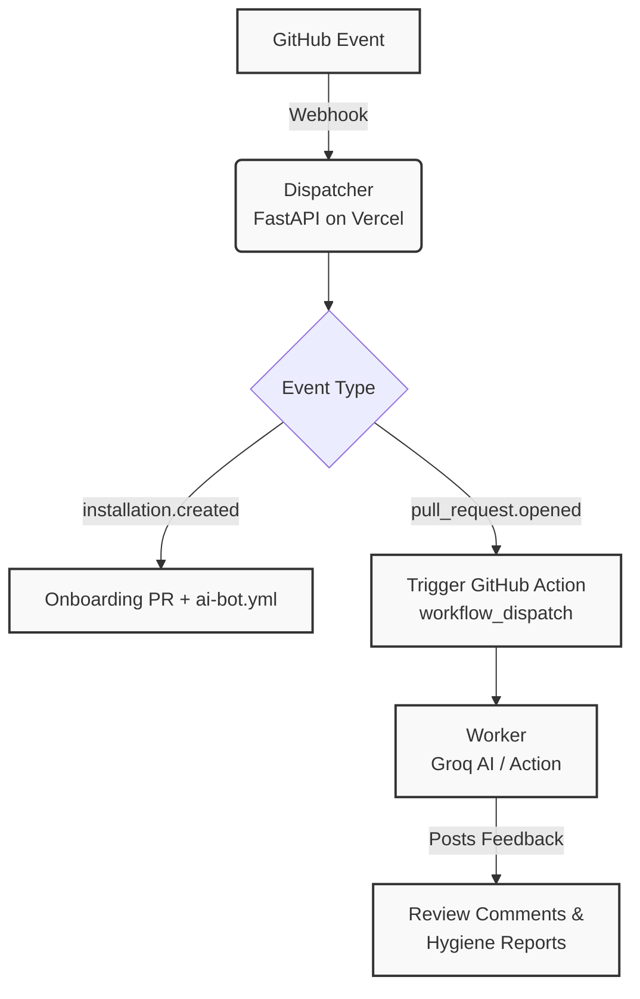

  
  <h1>🌳 RepoRanger</h1>
  
<strong>The Zero-Cost, Privacy-First Repository Guardian</strong>

  
  
  

---

**RepoRanger** is a powerful "Dispatcher-Worker" GitHub App that provides **AI-powered code reviews** and automated **branch hygiene**. 

Unlike other SaaS solutions, RepoRanger runs entirely on *your* infrastructure (GitHub Actions) using a relay model. This guarantees that your code, IP, and secrets **never leave your environment**.

---

## ✨ Why RepoRanger?

* 💸 **Zero Infrastructure Costs:** Designed to run 100% on the Vercel Free Tier and GitHub Actions.
* 🔐 **Privacy First:** Your `GROQ_API_KEY` stays safely in your GitHub Secrets.
* ⚡ **Senior-Level Feedback:** Powered by Groq (Llama-3-8b) for lightning-fast, ultra-low latency code reviews.
* 🧹 **Automated Janitor:** Keep your repository spotless with rich branch hygiene reports and signed deletion links.
* 🛡️ **Distributed Security:** The Dispatcher only routes webhooks; the Worker inside your repo does all the heavy lifting.

---

## 🛠️ Architecture

A lightweight Vercel app acts as the **Dispatcher** receiving GitHub Webhooks, while a GitHub Action within your repository acts as the **Worker**, securely performing AI and repository operations.

---

## 🚀 Getting Started

### 1. Deploy the Dispatcher to Vercel
Deploy the root of this repository to Vercel. Thanks to `vercel.json`, it will automatically detect the Python app.
You must set these **Environment Variables** in your Vercel project:
- `APP_ID`: Your GitHub App ID.
- `GITHUB_APP_PRIVATE_KEY`: Your GitHub App private key (paste the entire `.pem` file contents).
- `WEBHOOK_SECRET`: Your GitHub App webhook secret.
- `DELETE_SECRET`: A custom string for branch deletion link signatures (e.g., `my-super-secret-key-123`).

### 2. Configure Your GitHub App
- **Permissions Required**: 
  - `Pull Requests` (Read & Write)
  - `Contents` (Read & Write)
  - `Actions` (Read & Write)
  - `Issues` (Read & Write)
- **Webhooks**: Point the Webhook URL to `https://your-vercel-app.com/webhook`.

### 3. Let RepoRanger take over!
Once installed on a repository, RepoRanger will automatically open a **Welcome PR** with setup instructions. 
> 💡 **Tip:** Don't forget to add your `GROQ_API_KEY` to your repository secrets!

---

## 🧹 The Janitor — Command Reference

Keep your repository clean effortlessly! Activate commands by including keywords in the **title or body of a GitHub Issue**. Admins can interact directly via **issue comments**.

> **Note:** `<N>` represents a number of days. Branch names can contain letters, numbers, `/`, `.`, `_`, and `-`.

### 📋 Reporting Commands
Open a new Issue containing any of these keywords to trigger a report.

| Keyword | What it does |
|---------|--------------|
| `dead+branches=<N>` | 🔍 Posts a list of all branches inactive for > `N` days. |
| `branch+stats=<N>` | 📊 Detailed table showing last author, exact age, and commit date. |
| `unmerged+only=<N>` | ⚠️ Reports only stale branches that **have not** been merged. |
| `author+report=<N>` | 👥 Groups stale branches **by last committer**. Great for pinging the team! |
| `check+merged` | 👻 Reports "ghost branches" that were fully merged but forgotten. |

### ⏰ Scheduled Scanning
| Keyword | What it does |
|---------|--------------|
| `check+dead=<N>` | 🔁 Sets up a **recurring scan** every `N` days. RepoRanger will post a fresh dead-branch report to this issue automatically! |

Control schedules by replying with a comment on the tracking issue:
* `pause+janitor` ⏸ Pauses future scheduled reports.
* `resume+janitor` ▶ Resumes scheduled reports.
* `stop+janitor` 🛑 Permanently stops scanning and closes the tracking issue.

### 🔒 Branch Protection
| Keyword | What it does |
|---------|--------------|
| `protect+branch=<name>` | 🛡️ Marks a branch as protected (e.g. staging). The janitor will **never flag or delete** it. |

### 🗑️ One-Click Deletions
| Trigger | Who Can Use It | What it does |
|---------|----------------|--------------|
| Reply with exact `branch-name` | Owner/Member/Collaborator | 💥 Deletes that **single branch** immediately. |
| `delete+all+dead=<N>` in Issue | Owner/Member/Collaborator | ☢️ Nukes **all** branches older than `N` days in one shot. |

> ⚠️ **Warning:** `delete+all+dead` is irreversible! Protected branches (`main`, `develop`, etc.) are always skipped.

---

## 🛠️ Built With
- [FastAPI](https://fastapi.tiangolo.com/)
- [Vercel](https://vercel.com/)
- [GitHub Actions](https://github.com/features/actions)
- [Groq 🚀](https://groq.com/)

---

## ⚖️ License
Released under the [MIT License](LICENSE).
